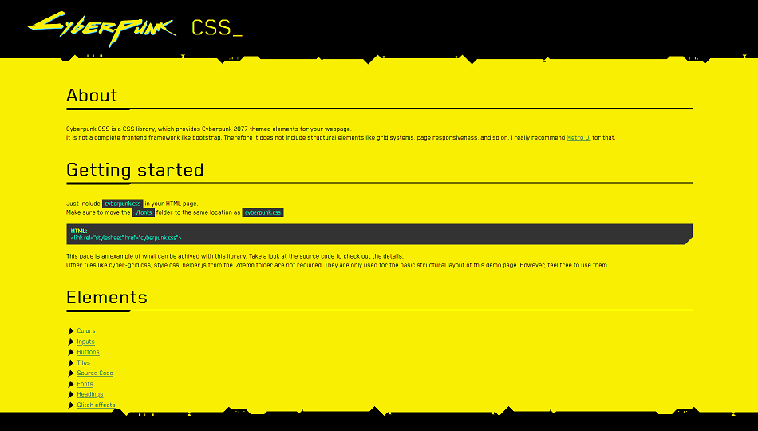
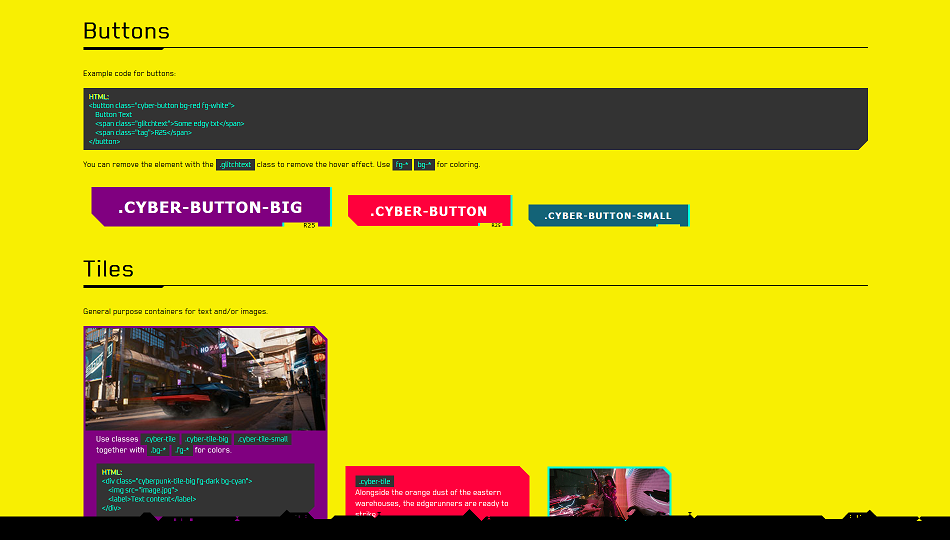
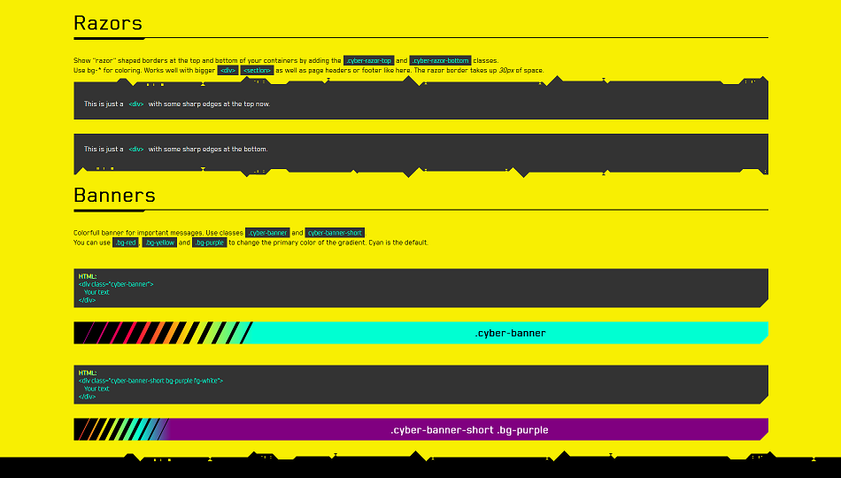

# cyberpunk-css
A pure CSS library providing Cyberpunk 2077 themed elements for your webpage.

Demo & getting started: https://alddesign.github.io/cyberpunk-css/demo/  

## Screenshots of the demo page:

  
  
  
  
