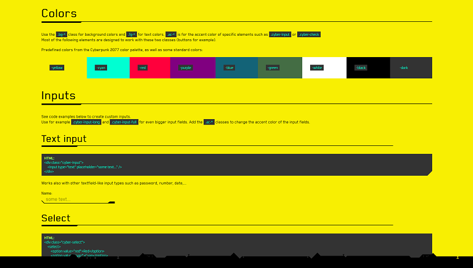

# !Feedback!
If this framework is missing anything you would like to have, please, let me know. Open up an issue or create a pull request.

# cyberpunk-css
A pure CSS library providing Cyberpunk 2077 themed elements for your webpage.

Demo & getting started: https://alddesign.github.io/cyberpunk-css/demo/  

## Screenshots of the demo page:

  
  
  
  
